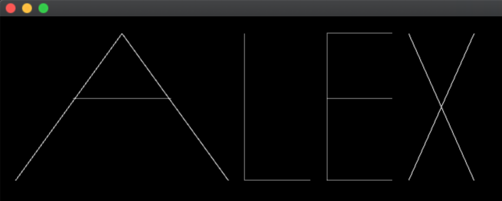

# Day 1: Graphics, variables & functions

- *Lecture time:* 3 hours
- *Homework time:* 2 hours

## Learning outcomes

- Create and run openFrameworks projects
- Introduce basic C++ syntax
- Use openFrameworks graphics functions (`ofDrawLine`, `ofDrawCircle` etc.) in the `draw` loop
- Understand the painter's algorithm
- Declare and assign primitive variables (`int`, `float`)
- Use variables to reduce redundancy
- Declare and define functions
- Generalize a function with parameters

## Exercises To Do Before Class

Before the first day of class, students should try installing both an *IDE* and *openFrameworks*. IDE stands for "integrated development environment" and is what allows students to run programming code on your computer. openFrameworks is a coding library that students will be using extensively at SFPC. Here are specific instructions for Mac and Windows:

### Mac OSX
- Install [Xcode 10](https://apps.apple.com/us/app/xcode/id497799835?mt=12) from the app store. If you have an older version of Xcode already installed, we recommend upgrading to the latest version. 
- When installing Xcode, you may be prompted to update your operating system. We recommend you do this.
- Download and install [openFrameworks for Mac.](https://openframeworks.cc/download/)
- There are more details instructions [here](https://openframeworks.cc/setup/xcode/) to test your setup, you only need the first two sections: “First Steps” and “Testing your setup”. 
- We recommend you use the latest version of OF and Xcode. If this is not possible, just drop us an email and we will help you sort it out.

### Windows
- Install [Visual Studio Community 2017](https://www.techspot.com/downloads/6278-visual-studio.html). Note that this is an older version of Visual Studio; please install this older version even if you have a newer version installed.
- Install [openFrameworks for Visual Studio.](https://openframeworks.cc/download/)
- More detailed setup guide is [here](https://openframeworks.cc/setup/vs/). We will also be able to help you in class.

### Linux
- QT Creator is the officially supported IDE. [Here are instructions](https://openframeworks.cc/setup/qtcreator/) for working with QT creator. If you’re using a different IDE [start here.](https://openframeworks.cc/setup/linux-install/)
- One request -- you'll need to install a compiler -- if you are on OSX, you should install xcode.  You can install this through the OSX app store (search for xcode). If you have an older version of OSX, it may ask you update the OS.  

Also, download openFrameworks for your given platform: http://openframeworks.cc/download/

## Lecture (3 hours)

### New project layout

First, we created a blank openFrameworks project. The following files are created for us.

-   `main.cpp` — we usually don't need to change this file; however, you can change the dimensions of the window here.
-   `ofApp.cpp` — this is the main file you'll edit, where most of your code will go.
-   `ofApp.h` — sometimes you will need to add variables to this file, but we won't need it much for now.

Open up the `ofApp.cpp` file. There's a special function within this file called `draw`. It looks like this:

```cpp
void ofApp::draw(){
  
}
```

This is where all of the code that draws to the screen will go.

## Basic graphics

Next, we covered the following basic drawing concepts in openFrameworks:

-   The coordinate system in openFrameworks has a reversed y-axis from what we're used to. Moving _down_ the screen means _larger_ y values.
-   `ofDrawLine(x1, y1, x2, y2)` can be used to draw a line from starting point (x1, y1) to ending point (x2, y2).

## Exercise 1: Draw a diagonal line

Draw a line from the top-left corner of the window to the bottom-right corner right corner. Remember that if we want to get the width and height of the window, we can take a look inside of `main.cpp`.

### Solution

Modify the `draw` function in `ofApp.cpp`:

```cpp
void ofApp::draw() {
    ofDrawLine(0, 0, 1024, 768);
}
```

What if we want to add some padding to the line, so it doesn't go _all_ the way to the corner?

```cpp
void ofApp::draw() {
    ofDrawLine(10, 10, 1024 - 10, 768 - 10);
}
```

*Important*: we can put math, like `1024 - 10`, inside our call to `ofDrawLine`.

## More basic graphics & painter's algorithm

We introduced comments (lines beginning with `//`) as an important tool for "writing a letter to yourself in code." Example:

```cpp
void ofApp::draw() {
    // The following code draws a line!
    ofDrawLine(10, 10, 1024 - 10, 768 - 10);
}
```

`ofBackground(red, green, blue)` can be used to set the background color. The values of `red`, `green`, and `blue` must be numbers in the range of 0 – 255, where 0 represents "no color at all" and 255 represents "a maximum amount of that color". Example:

```cpp
void ofApp::draw() {
    // full red and blue with no green makes purple
    ofBackground(255, 0, 255);
}
```

The call to `ofBackground` must come before `ofDrawLine`:

```cpp
void ofApp::draw() {
    ofBackground(255, 0, 255);
    ofDrawLine(10, 10, 1024 - 10, 768 - 10);
}
```

If the lines are switched, then the call to `ofBackground` overwrites the line that comes before it:

```cpp
void ofApp::draw() {
    // This renders a blank screen with no line
    ofDrawLine(10, 10, 1024 - 10, 768 - 10);
    ofBackground(255, 0, 255);
}
```

This introduces two important concepts:

1. _Lines of code are executed in a precise order, starting with the first line of a function and continuing down_.
2. The *painter's algorithm*. openFrameworks graphics calls are like commands that you would give to a painter ("first paint the background purple, next paint a line"). If you command the painter to fill in a background as the last step in a list of instructions, it covers up what is below it.

Finally, we looked at two more primitive drawing functions: `ofDrawCircle(x, y, radius)` and `ofDrawRectangle(x, y, width, height)`. Examples:

```cpp
void ofApp::draw() {
    ofBackground(255, 0, 255);

    // A circle at position (50, 40) with radius 20:
    ofDrawCircle(50, 40, 20);

    // A rectangle with top left corner at (100, 200),
    // width of 50 and height of 30:
    ofDrawRectangle(100, 200, 50, 30);
}
```

## Exercise 2: Draw your name

Using openFrameworks primitives (lines, circles and rectangles), draw your name in the `draw` function.

### Solution

Here's an example for the name "ALEX":

```cpp
void ofApp::draw(){
  ofBackground(0);
  
  // A
  ofDrawLine(20, 200, 150, 20);
  ofDrawLine(150, 20, 280, 200);
  ofDrawLine(90, 100, 210, 100);
  
  // L
  ofDrawLine(300, 20, 300, 200);
  ofDrawLine(300, 200, 380, 200);
  
  // E
  ofDrawLine(400, 20, 400, 200);
  ofDrawLine(400, 20, 480, 20);
  ofDrawLine(400, 100, 480, 100);
  ofDrawLine(400, 200, 480, 200);

  // X
  ofDrawLine(500, 20, 580, 200);
  ofDrawLine(500, 200, 580, 20);
}
```

This yields the following picture:




## Variables, functions and parameters

- TODO: Variables
- TODO: Types
- TODO: mouseX / mouseY
- TODO: defining functions
- TODO: parameters

## Exercise 3: Write a function to draw a letter

We broke this exercise down into smaller parts.

1.  Draw the first letter of your name twice. Unless a student has previous 
2.  Factor out redundant code using a variable
3.  Factor out redundant code using a function

TODO: Give solution code

## Homework 1: Generalize your letter function (2 hours)

TODO: 

## Vocabulary

## Common misconceptions & questions

-   *Does the order of lines matter?*

    Most of the time, yes. Lines of code inside of a function are run sequentially, one right after the other. However, sometimes the order of code doesn't matter. For example, when you're defining a new function, it doesn't matter where you put the function.

-   *I'm confused by all the numbers in code like `ofDrawRectangle(20, 30, 60, 40)`!*

    This list of numbers tells `ofDrawRectangle` exactly what sort of rectangle you want to draw. The order of the numbers is _very important_. The first two numbers are the (x, y) position of the top-left corner of the rectangle (in the above example, (20, 30)), and the second two numbers are the width and height (in this example, a width of 60 and a height of 40). _Every function interprets the numbers you pass into it in a specific way._ `ofDrawRectangle` is different from `ofDrawCircle`, for example. If you forget which order the numbers go in, you can refer to the openFrameworks documentation. (These numbers are technically called _arguments_, although students don't often refer to them as such at this point.)

-   *How does the coordinate system of the window work?*

    The top left corner of the window is the origin, or point (0, 0). As you move to the right, you increase the x-coordinate. So point (100, 0) is 100 pixels to the right of the origin, but still at the top of the window. As you move downwards, you increase the y-coordinate. So (0, 100) is 100 pixels _below_ the origin, but against the left-hand side of the window. Note that the y-axis is flipped relative to the standard x/y coordinates you may be familiar with from math class.

-   *Can I change the width and height of the window?*

    Yes, you can do this by changing the following line in `main.cpp`:

    ```cpp
    ofSetupOpenGL(1024,768,OF_WINDOW);
    ```

    Change `1024` to whatever width you want, and `768` to whatever height you want.

-   *I get an error that says "Expected ';' after expression"*

    Almost every line in C++ ends with a semi-colon. This is an important piece of coding syntax.

## Student Reflections, Takeaways & Next Steps
Additional materials for the students to leave with that can help them dig deeper into the subject or additional exercises and challenges to help students progress their knowledge to the next level and gain mastery of the subject through independent study.

* Multiple Project Exit Points: an idea of high-medium-low projects so students are locked into one end product.
  * First Steps - a simple exercise
  * Next Steps - medium exercise
  * Big Steps - a challenge or open ended study
* Presentation: how might students share their work? With peers, outside world? What media or platforms could/should be referenced to students to encourage sharing (Instagram, Tumblr...)? 
* Reflection: reflection questions that ask students to think about CS concepts and practices. How can students express what they’ve learned in some creative way?

## Post Session

### References
Include any sources cited, but not directly linked in the unit.

### Implementation Guidance & Teaching Reflection  
e.g. Please provide some guidance based on experience delivering the unit and potential modifications might you are considering making for future iterations of this unit. This is an opportunity for you as the unit author to give teachers practical guidance.

***With thanks and acknowledgement, we were inspired by the curriculum templates shared by [NYCDOE](http://blueprint.cs4all.nyc/units/40/) and [NYC Open Data](https://github.com/datapolitan/Data_Analytics_Classes/blob/gh-pages/Excel_Tools_Summarizing_Data.md)***

