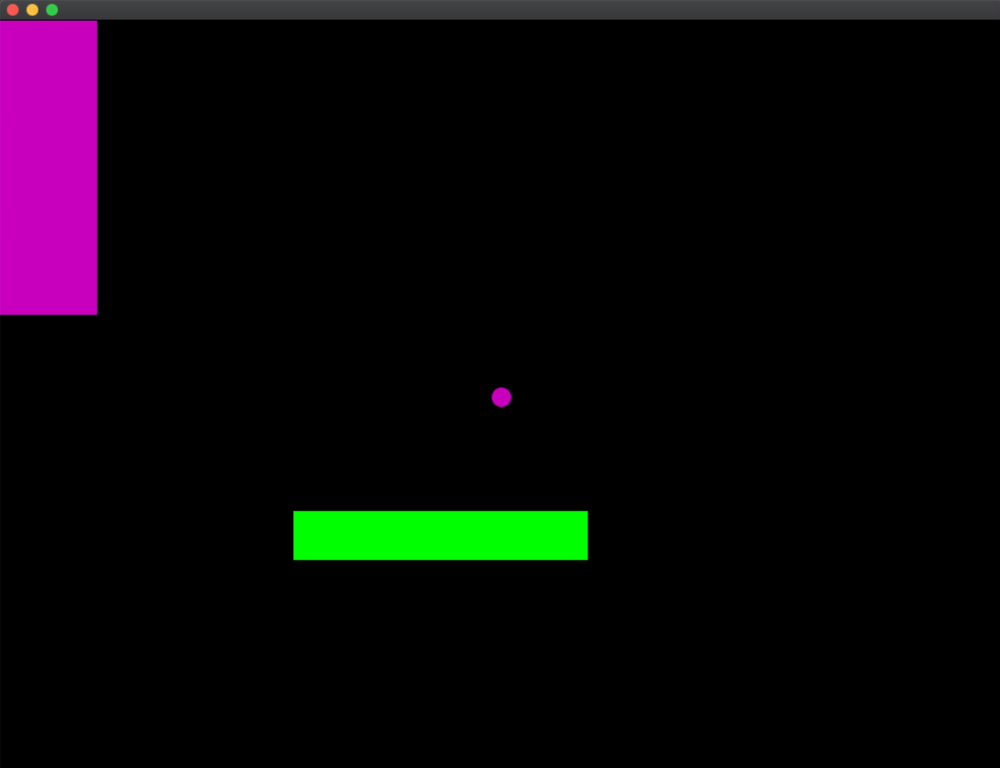

TODO: are we calling out

ofPoint p;
p.x = 10;
p.y = 20;

ofPoint p(10, 20);


TODO: talk about boolean logic here more

# Day 2: Random numbers, control flow and returns

- **Lecture time:** 3 hours
- **Homework time:** 2 hours

## Learning outcomes

- Use `cout` to log values
- Use `ofRandom` to produce random numbers in various ranges
- Draw shapes with different colors; understand how `ofSetColor` uses painter's algorithm
- Put variables in `ofApp.h` that persist over the lifetime of the program
- Use the openFrameworks `setup` function to initialize variables
- If statements
- For loops
- Nested for loops
- Use the `sin` function for animation
- Write functions that return values
- Understand state updates of the form `x = transform(x)`

## Lecture (3 hours)

### Logging things to the console

First, let's learn how to log things to the console. This is useful for printing out the values of functions and variables.

```cpp
void ofApp::draw() {
    cout << ofGetWidth() << endl;
}
```

The `<<` here is a special C++ syntax that allows us to send output to the console. We can chain together multiple parts of output using `<<`. In the above example, we're printing out the width of the window, and then appending an `endl`. The `endl` stands for "end line", and adds a line break to the output (the same as when you hit "return" on your keyboard).

### Functions that return values

We'll then cover a host of useful openFrameworks functions.

- `ofGetWidth()`, `ofGetHeight()` — get the width and height of the window
- `ofGetElapsedTimef()` — get the number of seconds since the program has started
- `ofRandom(max)`, `ofRandom(min, max)` — generate random numbers in a specified range

There's something special about all of these functions: they _return_ a value. What does it mean for a function to return a value? It means that the function sends the value back to your code. For example:

```cpp
// x will be set to a random number returned by
// ofGetRandom, between 0 - 1.
float x = ofRandom(1);
```

You can visualize this by imagining that the function is replaced by a number that it returns. You can picture the line above turning into the code below when the `ofGetRandom()` function returns a value.

```cpp
// let's pretend ofRandom returned 0.45
float x = 0.45;
```

### ofRandom

Let's focus on this `ofGetRandom()` function some more. We can try passing a more interesting parameter to it:

```cpp
void ofApp::draw() {
    cout << ofRandom(mouseX) << endl;
}
```

In this example, we're generating random numbers that are between 0 and `mouseX`. We can change the range by adjusting the mouse. What about the following code?

```cpp
void ofApp::draw() {
  cout << ofRandom(mouseX, mouseY) << endl;
}
```

Now we're generating random numbers between `mouseX` and `mouseY`. We can change the range by moving the mouse around the screen. We can discuss what the range would be at different (x, y) positions in the window. Next we're going to save a random value in a variable, and use it to draw something.

```cpp
void ofApp::draw(){
  ofBackground(0);

  // generate a random number between 0 and the width
  float xPos = ofRandom(ofGetWidth());

  // generate a random number between 0 and the height
  float yPos = ofRandom(ofGetHeight());

  // draw a circle at that random position
  ofDrawCircle(xPos, yPos, 10);
}
```

Running this program causes a circle to flicker around the screen. Every frame, a new random position is chosen.

Let's touch on a small syntax detail. If we want, we don't need to save the `ofRandom` values to variables — we can insert them directly into the call to `ofDrawCircle`:

```cpp
void ofApp::draw(){
  ofBackground(0);

  // draw a circle at that random position
  ofDrawCircle(ofRandom(ofGetWidth()), ofRandom(ofGetHeight()), 10);
}
```

This code has an identical effect to the previous version, but is more succinct. There is not really a preference for either style; one is more verbose, but potentially more clear. The other is shorter but potentially harder to understand.

### Color

We use the function `ofSetColor(red, blue, green)` to choose colors. Recalling the painter's algorithm from day 1: openFrameworks models its graphics functions after a painter painting on a canvas. When we call `ofSetColor`, it's analogous to a painter dipping their paintbrush in a bucket of paint. For example:

```cpp
void ofApp::draw(){
  ofBackground(0);

  // put paint on the paint brush
  ofSetColor(0, 70, 190);

  // draw a circle at that random position, with the color
  ofDrawCircle(0.5 * ofGetWidth(), 0.5 * ofGetHeight(), 10);
}
```

It's important to understand that the color _stays on the paintbrush_ until we set a different color.

```cpp
void ofApp::draw(){
  ofBackground(0);

  // put paint on the paint brush
  ofSetColor(0, 70, 190);

  // draw a circle at that random position, with the color
  ofDrawCircle(0.5 * ofGetWidth(), 0.5 * ofGetHeight(), 10);

  // this rectangle will also use the same color
  ofDrawRectangle(0, 0, 100, 300);
}
```

This gets into a detail about openFrameworks: it maintains state behind the scene. It's like a drawing machine with lots of buttons and switches and an internal state. When we call `ofSetColor`, we're setting the state of this machine.

To draw a new shape with a different color, we can call `ofSetColor` again before drawing that new shape:

```cpp
void ofApp::draw(){
  ofBackground(0);
  
  // put paint on the paint brush
  ofSetColor(200, 0, 190);
  
  // draw a circle at that random position, with the color
  ofDrawCircle(0.5 * ofGetWidth(), 0.5 * ofGetHeight(), 10);
  
  // this rectangle will also use the same color
  ofDrawRectangle(0, 0, 100, 300);
  
  // dip paintbrush in a new color of paint
  ofSetColor(0, 255, 0);
  
  ofDrawRectangle(300, 500, 300, 50);
}
```



There's a function called `ofNoFill()` we can use to draw unfilled shapes. We can also use of `ofSetLineWidth()` to set the line size.


```cpp
void ofApp::draw(){
  ofBackground(0);
  
  ofNoFill();
  ofSetLineWidth(5);

  // put paint on the paint brush
  ofSetColor(200, 0, 190);
  
  // draw a circle at that random position, with the color
  ofDrawCircle(0.5 * ofGetWidth(), 0.5 * ofGetHeight(), 10);
  
  // this rectangle will also use the same color
  ofDrawRectangle(0, 0, 100, 300);
  
  // dip paintbrush in a new color of paint
  ofSetColor(0, 255, 0);
  
  ofDrawRectangle(300, 500, 300, 50);
}
```


### Using the setup function

Thus far, we've only been putting code in the openFrameworks `draw` function. There are lots of other openFrameworks functions we can put code in. One such function is `setup`. Code placed `setup` only runs once, at the beginning of the program while code in `draw` runs many times a second. Example:


```cpp
void ofApp::setup() {
  cout << "hello from setup!" << endl;
}


void ofApp::draw() {
  cout << "hello from draw!" << endl;
}
```

If you run this program, you'll see output like the followng:

```
hello from setup!
hello from draw!
hello from draw!
hello from draw!
hello from draw!
hello from draw!
hello from draw!
...
```

As you can see, the setup line is printed just once at the beginning of the program, while the draw line is printed continuously afterwards.

### Using variables in the ofApp.h file

Let's start with a simple program that draws a circle in the center of the window:

```cpp
void ofApp::draw(){
  float x = ofGetWidth() / 2;
  float y = ofGetHeight() / 2;
  ofDrawCircle(x, y, 10);
}
```

We're going to make a big change here. We're going to move our x and y variables to the `ofApp.h` file. The full `.h` file should look like this:

```cpp
class ofApp : public ofBaseApp{

    public:
        void setup();
        void update();
        void draw();

        void keyPressed(int key);
        void keyReleased(int key);
        void mouseMoved(int x, int y );
        void mouseDragged(int x, int y, int button);
        void mousePressed(int x, int y, int button);
        void mouseReleased(int x, int y, int button);
        void mouseEntered(int x, int y);
        void mouseExited(int x, int y);
        void windowResized(int w, int h);
        void dragEvent(ofDragInfo dragInfo);
        void gotMessage(ofMessage msg);

        float x;
        float y;
        
};
```

Now go back to your `ofApp.cpp` file and change the setup and draw functions to the following:

```cpp
void ofApp::setup() {
  x = ofGetWidth() / 2;
  y = ofGetHeight() / 2;
}

void ofApp::draw() {
  ofDrawCircle(x, y, 10);
}
```

This will continue to draw a circle in the center of the screen, but now our variable is being declared in the `.h` file. But why would we want to do this? Well, now we can _change the state of x over the duration of the program_.

```cpp
void ofApp::setup() {
  x = ofGetWidth() / 2;
  y = ofGetHeight() / 2;
}

void ofApp::draw() {
  // add 1 to x
  x = x + 1;
  ofDrawCircle(x, y, 10);
}
```

The line `x = x + 1` is something we haven't seen before. It's important to understand that the right side of this assignment is evaluated: `x + 1`first. Then `x` is assigned to this new value. In other words, 1 is added to the variable `x`. If we run the program, we'll see the x position of the circle change over time, because 1 is added to `x` on every frame of the program.

This is only possible because we have declared `x` in the `.h` file. Declaring it here causes `x` to persist over the lifetime of the program. This allows us to store state that persists.

Now we can do interesting things with this state:

```cpp
void ofApp::setup() {
  x = ofGetWidth() / 2;
  y = ofGetHeight() / 2;
}

void ofApp::draw() {
  x = x + ofRandom(-1, 1);
  y = y + ofRandom(-1, 1);
  ofDrawCircle(x, y, 10);
}
```

This causes the circle to do a "random walk" across the screen. If we wait long enough, the circle will eventually leave the screen. If we want to keep the circle inside of the bounds of the screen, then we must use *if statements*.

### If statements

If statements are a very powerful programming construct. They allow us to control the flow of the program based on conditions, and every programming language has them.

If we want to test to see if our circle is beyond the right hand side of the screen, we can write the following:

```cpp
if (x > ofGetWidth()) {
  // x is larger than the width!
}
```

We can put code within the `{` and `}` that we want to run if the case is true. For example, we can force the circle to stay within the bound:

```cpp
if (x > ofGetWidth()) {
  // if x is larger than the width, the reset x to be the width
  x = ofGetWidth();
}
```

### Exercise 1: Keep the circle within the bounds

Modify the random walk example so that the circle will stay within the bounds of the window. We've already written one if statement above to keep the circle from going off the right hand side of the window. Now we must write more if statements to prevent it from going off the other edges.

#### Exercise 1 solution


`ofApp.h`:

```cpp
class ofApp : public ofBaseApp{

    public:
        void setup();
        void update();
        void draw();

        void keyPressed(int key);
        void keyReleased(int key);
        void mouseMoved(int x, int y );
        void mouseDragged(int x, int y, int button);
        void mousePressed(int x, int y, int button);
        void mouseReleased(int x, int y, int button);
        void mouseEntered(int x, int y);
        void mouseExited(int x, int y);
        void windowResized(int w, int h);
        void dragEvent(ofDragInfo dragInfo);
        void gotMessage(ofMessage msg);

        float x;
        float y;
        
};
```

`ofApp.cpp`:

```cpp
void ofApp::setup() {
  x = ofGetWidth() / 2;
  y = ofGetHeight() / 2;
}

void ofApp::draw() {
  x = x + ofRandom(-1, 1);
  y = y + ofRandom(-1, 1);

  if (x > ofGetWidth()) {
    x = ofGetWidth();
  }

  if (y > ofGetHeight()) {
    y = ofGetHeight();
  }


  if (x < 0) {
    x = 0;
  }


  if (y < 0) {
    y = 0;
  }

  ofDrawCircle(x, y, 10);
}

// other functions not shown
```


## Looping

Next we'll learn about another control structure called loops. To motivate this, let's say we wanted to draw a ton of circles every frame:

```cpp
void ofApp::draw() {
  ofDrawCircle(ofRandom(ofGetWidth()), ofRandom(ofGetHeight()), 10);
  ofDrawCircle(ofRandom(ofGetWidth()), ofRandom(ofGetHeight()), 10);
  ofDrawCircle(ofRandom(ofGetWidth()), ofRandom(ofGetHeight()), 10);
  ofDrawCircle(ofRandom(ofGetWidth()), ofRandom(ofGetHeight()), 10);
  ofDrawCircle(ofRandom(ofGetWidth()), ofRandom(ofGetHeight()), 10);
  ofDrawCircle(ofRandom(ofGetWidth()), ofRandom(ofGetHeight()), 10);
  ofDrawCircle(ofRandom(ofGetWidth()), ofRandom(ofGetHeight()), 10);
  ofDrawCircle(ofRandom(ofGetWidth()), ofRandom(ofGetHeight()), 10);
  ofDrawCircle(ofRandom(ofGetWidth()), ofRandom(ofGetHeight()), 10);
  ofDrawCircle(ofRandom(ofGetWidth()), ofRandom(ofGetHeight()), 10);
  ofDrawCircle(ofRandom(ofGetWidth()), ofRandom(ofGetHeight()), 10);
  ofDrawCircle(ofRandom(ofGetWidth()), ofRandom(ofGetHeight()), 10);
  ofDrawCircle(ofRandom(ofGetWidth()), ofRandom(ofGetHeight()), 10);
  ofDrawCircle(ofRandom(ofGetWidth()), ofRandom(ofGetHeight()), 10);
  ofDrawCircle(ofRandom(ofGetWidth()), ofRandom(ofGetHeight()), 10);
}
```

This does what we want, but it's redundant, and programmers hate redundancy. We're repeating ourselves too much. In this case, we can use a for loop to automate this repetition.

```cpp
void ofApp::draw() {
  // run ofDrawCircle 10 times
  for (int i = 0; i < 10; i = i + 1) {
    ofDrawCircle(ofRandom(ofGetWidth()), ofRandom(ofGetHeight()), 10);
  }
}
```

For loops are very syntax heavy, and we'll become more familiar with the syntax over time. For now, what's important to understand is that the code inside of the for loop will run 10 times. We can adjust the number of times the for loop runs by changing the _loop bound_:

```cpp
void ofApp::draw() {
  // run ofDrawCircle 100 times
  for (int i = 0; i < 100; i = i + 1) {
    ofDrawCircle(ofRandom(ofGetWidth()), ofRandom(ofGetHeight()), 10);
  }
}
```

A more sophisticated example of looping is to use the looping variable `i`. The first thing to understand is that we can decide how we increment `i`. Let's look at a few examples:

```cpp
for (int i = 0; i < 10; i = i + 1) {
  cout << i << endl;
}
```

This prints out:

```
0
1
2
3
4
5
6
7
8
9
```

We can adjust the loop increment by adding 2 to `i` rather than 1:

```cpp
for (int i = 0; i < 10; i = i + 2) {
  cout << i << endl;
}
```

This prints out:

```
0
2
4
6
8
```

Now let's use this `i` value in order to draw a series of circles:

```cpp
void ofApp::draw() {
  for (int i = 0; i < ofGetWidth(); i = i + 20) {
    ofDrawCircle(i, ofGetHeight() * 0.5, 10);
  }
}
```


### Syntax of a for loop

Let's review the specific pieces of the for loop syntax:

```cpp      
for (initialization; condition; update) {
  // body
}
```

- *initialization*: runs once at the beginning of the for loop and sets up the _looping variable_.
- *condition*: determines when the loop stops running. If the expression here evaluates to true, then the loop continues to run.
- *update*: updates the looping variable by some increment
- *body*: the code that runs every time the condition is true

### Nested for loops

We can put for loops inside of for loops. A common use case of this structure in creative coding is to draw grids. In the following example, we have one for loop that runs over the *height*, and inside of that, we have another loop that runs over the *width*. We draw circles using the looping variables `i` and `j`.

```cpp      
void ofApp::draw() {
  ofBackground(0);
  
  for (int j = 0; j < ofGetHeight(); j = j + 30) {
    for (int i = 0; i < ofGetWidth(); i = i + 30) {
      ofDrawCircle(i, j, 10);
    }
  }
}
```

This code produces the following image:


### Review of functions

Let's back up and review functions for a bit. You might remember functions from math class. A function is a mathematical object that takes an input and spits out an output. For example:

```
y = f(x)
```

The function `f` here takes a parameter `x` and spits out an output. c++ functions work the same way. They can take parameters, perform some computation, and return an output. We can actually use many functions from math in c++. For example, the `sin` function.

```cpp
void ofApp::draw() {
  ofBackground(0);

  float x = sin(ofGetElapsedTimef());
  ofDrawCircle(ofGetWidth() / 2 + x, ofGetHeight() / 2, 10);
}
```

Remember from math class that as we increase the value we put into `sin(...)`, it spits out a value that oscillates between +1 and -1. If we consider that we're putting `ofGetElapsedTimef()` into our sin function, then we know that our `float x` variable will be set to values between +1 and -1 in an oscillating pattern.

However, this oscillation is barely visible, because it is only moving 1 pixel to the left and right. So let's scale up this oscillation by multiplying the result of our `sin` function:

```cpp
void ofApp::draw() {
  ofBackground(0);

  float x = sin(ofGetElapsedTimef()) * 100;
  ofDrawCircle(ofGetWidth() / 2 + x, ofGetHeight() / 2, 10);
}
```

Now you should see the circle moving from left to right and back again! `sin` is very useful in creative coding because it repeats for infinity as you plug larger and larger values into it.

// TODO: rewrite this exercise to be a big bigger

### Exercise 2: Use sin to animate a circle

Building off the example above, let's say we want our circle to move from the far left hand side of the window to the far right hand side. What should we multiply our `sin` function by to get that effect?

#### Exercise 2 solution

```cpp
void ofApp::draw() {
  ofBackground(0);

  float x = sin(ofGetElapsedTimef()) * ofGetWidth() / 2;
  ofDrawCircle(ofGetWidth() / 2 + x, ofGetHeight() / 2, 10);
}
```

## Writing a function with input and output

Let's emphasize this one more time: the `sin` function _takes an input and returns an output_. We can write our own functions that do the same thing. We've already written a function that takes input in the form of parameters. If we want to write a function that also returns an output, we need to declare it in our `ofApp.h` file:

```cpp
class ofApp : public ofBaseApp{

    public:
        void setup();
        void update();
        void draw();

        void keyPressed(int key);
        void keyReleased(int key);
        void mouseMoved(int x, int y );
        void mouseDragged(int x, int y, int button);
        void mousePressed(int x, int y, int button);
        void mouseReleased(int x, int y, int button);
        void mouseEntered(int x, int y);
        void mouseExited(int x, int y);
        void windowResized(int w, int h);
        void dragEvent(ofDragInfo dragInfo);
        void gotMessage(ofMessage msg);
  
        float transform(float input);
};
```

The line `float transform(float input);` declares a new function which accepts a `float` as input and returns a `float` as output. Now we must define our function in the `ofApp.cpp` file. Add this code anywhere in the `.cpp` file:

```cpp
float ofApp::transform(float input) {
  return input;
}
```

We've introduced a new concept here: the `return` keyword. This "sends out" a value from the function, in the same way parameters "send in" values to the function. We can call our function from the draw function:

```cpp
float output = transform(1);
cout << output << endl;
```

In this case, the `1` parameter is passed into `transform`, which then immediately returns it. So what will this print?

```
1
```

Now let's change our transform function:

```cpp
float ofApp::transform(float input) {
  return input + 1;
}
```

Our transform function now takes whatever the input parameter is, adds 1 to it, and returns it. Running our program again produces the following output:

```
2
```

This isn't a very useful function right now, so let's construct a more realistic example with a sophisticated function. In this example, we're going to create a circle that follows the x position of the mouse. But rather than having the circle snap exactly to the position of the mouse, it will "ease" into the mouse position.

Update the `.h` file with a variable `x`:

```cpp
class ofApp : public ofBaseApp {

    public:
        void setup();
        void update();
        void draw();

        void keyPressed(int key);
        void keyReleased(int key);
        void mouseMoved(int x, int y );
        void mouseDragged(int x, int y, int button);
        void mousePressed(int x, int y, int button);
        void mouseReleased(int x, int y, int button);
        void mouseEntered(int x, int y);
        void mouseExited(int x, int y);
        void windowResized(int w, int h);
        void dragEvent(ofDragInfo dragInfo);
        void gotMessage(ofMessage msg);
  
        float transform(float input);
        float x;
};
```

Now let's update our draw and setup function in the `ofApp.cpp` file:


```cpp
void ofApp::setup(){
  x = ofGetWidth() / 2;
}

void ofApp::draw(){
  ofBackground(0);
  x = transform(x);
  ofDrawCircle(x, ofGetHeight() / 2, 10);
}

```

This will initialize the variable `x` to the middle of the window, and then continuously draw a circle at that x position. Every frame, our x position will be transformed by the `transform` function. Let's update our transform function with an *easing* algorithm:

```cpp
float ofApp::transform(float input) {
  float t = 0.99;
  float u = 1.0 - t;
  return u * mouseX + t * input;
}
```

Now this function is doing something fancy: it's taking the input and mixing it with the current position of the mouse, and then returning that new value. What do we mean by "mixing"? The expression `u * mouseX + t * input` takes a fraction of the `mouseX` variable and sums it with a fraction of the `input` value, producing a new value which is a mix both both.

Remember, we're calling this function in our draw function, and using it to transform the x value:

```cpp
x = transform(x);
```

If we run the program now, we'll see a circle that follows the mouse, but "eases" into position rather than snapping into position.


## Homework 2: Bouncing circle (2 hours)

This homework is inspired by this [gag from The Office](https://www.youtube.com/watch?v=QOtuX0jL85Y). Create a program which contains a circle that bounces on the sides of the screen. A good starting point for this homework is the random walk circle that we created earlier. As a reminder, here is the full code for that example:

`ofApp.h`:

```cpp
#pragma once

#include "ofMain.h"

class ofApp : public ofBaseApp{
  
public:
  void setup();
  void update();
  void draw();
  
  void keyPressed(int key);
  void keyReleased(int key);
  void mouseMoved(int x, int y );
  void mouseDragged(int x, int y, int button);
  void mousePressed(int x, int y, int button);
  void mouseReleased(int x, int y, int button);
  void mouseEntered(int x, int y);
  void mouseExited(int x, int y);
  void windowResized(int w, int h);
  void dragEvent(ofDragInfo dragInfo);
  void gotMessage(ofMessage msg);
  
  float x;
  float y;
  float vx;
  float vy;
};
```

`ofApp.cpp`:

```cpp
#include "ofApp.h"

void ofApp::setup() {
  x = ofGetWidth() / 2;
  y = ofGetHeight() / 2;
}

void ofApp::draw() {
  ofBackground(0);

  x = x + ofRandom(-1, 1);
  y = y + ofRandom(-1, 1);

  if (x > ofGetWidth()) {
    x = ofGetWidth();
  }

  if (y > ofGetHeight()) {
    y = ofGetHeight();
  }


  if (x < 0) {
    x = 0;
  }


  if (y < 0) {
    y = 0;
  }

  ofDrawCircle(x, y, 10);
}

// other functions not shown

```

Hint: this problem will require you to add more variables to the `ofApp.h` file.

### Homework 2 solution

`ofApp.h`:

```cpp
#pragma once

#include "ofMain.h"

class ofApp : public ofBaseApp{
  
public:
  void setup();
  void update();
  void draw();
  
  void keyPressed(int key);
  void keyReleased(int key);
  void mouseMoved(int x, int y );
  void mouseDragged(int x, int y, int button);
  void mousePressed(int x, int y, int button);
  void mouseReleased(int x, int y, int button);
  void mouseEntered(int x, int y);
  void mouseExited(int x, int y);
  void windowResized(int w, int h);
  void dragEvent(ofDragInfo dragInfo);
  void gotMessage(ofMessage msg);
  
  float x;
  float y;
  float vx;
  float vy;
};
```

`ofApp.cpp`:

```cpp
#include "ofApp.h"

void ofApp::setup() {
  x = ofGetWidth() / 2;
  y = ofGetHeight() / 2;
  
  vx = 1;
  vy = 1;
}

void ofApp::draw() {
  ofBackground(0);
  
  x = x + vx;
  y = y + vy;
  
  if (x > ofGetWidth()) {
    x = ofGetWidth();
    vx *= -1;
  }
  
  if (y > ofGetHeight()) {
    y = ofGetHeight();
    vy *= -1;
  }
  
  
  if (x < 0) {
    x = 0;
    vx *= -1;
  }
  
  
  if (y < 0) {
    y = 0;
    vy *= -1;
  }
  
  ofDrawCircle(x, y, 10);
}

// other functions not shown
```

## Vocabulary

## Common misconceptions & questions

-   **How does returning values work?**

    The important thing to understand about `return` is it allows one function to send an output to another function. Here's a good way to think about it. Let's say we have a function called `returnsFive` that returns the number 5:

    ```cpp
    float ofApp::returnsFive() {
        return 5;
    }
    ```

    Now let's call this function in our draw function:

    ```cpp
    void ofApp::draw() {
        float myValue = returnsFive();
    }
    ```

    What is the value stored in `myValue`? The first thing the program does is evaluate the code on the right-hand side of the equals sign. In this case, that code is a call to `returnsFive`. The program goes inside that function, runs it, and finds the value returned by the function. In this case, the return value is 5. You can think of program as replacing the call to `returnsFive` with its corresponding return value:

    ```cpp
    void ofApp::draw() {
        float myValue = 5;
    }
    ```

    So in this case, the value 5 is assigned to `myValue`. This technique of mentally replacing a function call with its return value is useful for understanding how function "send back" return values into another function.

-   **Assigning to variables**
    
    This is often confusing for students:

    ```
    x = x + 1;
    ```

    The confusion stems from the subtle order of operations for assignment. The fact that the right hand side of the `=` is evaluated first, followed by assignment, is not obvious. It can help to step through it like this:

    ```
    float x = 5;

    x = x + 1; becomes
    x = 5 + 1; becomes
    x = 6;

    so at the end, x is assigned to 6.

    ```

-   **Why does changing the color cause the color of things to change at the top of `draw`?**
    
    Here's an example that causes this question to arise:

    ```cpp
    void ofApp::draw(){
      ofBackground(0);

      ofDrawLine(0, 0, ofGetWidth(), ofGetHeight());

      // put paint on the paint brush
      ofSetColor(0, 70, 190);

      // draw a circle at that random position, with the color
      ofDrawCircle(0.5 * ofGetWidth(), 0.5 * ofGetHeight(), 10);
    }
    ```

    Both the line and the circle will have the same color in this case. Why is that? Because the call to `ofSetColor` sets the state of openFrameworks, and this state persists across draws. In other words, at the end of the draw function, the draw function starts again, and the color carries over from the past draw function.

-   **Error: Function definition is now allowed here**

    This often means you're missing closing curly braces. For example:

    ```cpp
    void ofApp::draw(){  
      for (int j = 0; j < ofGetHeight(); j = j + 30) {
        for (int i = 0; i < ofGetWidth(); i = i + 30) {
          ofDrawCircle(i, j, 10);
        }
    }
    ```

    This will cause errors because the outer for loop is missing a closing curly brace `}`. Let's add it back in:

    ```cpp
    void ofApp::draw(){  
      for (int j = 0; j < ofGetHeight(); j = j + 30) {
        for (int i = 0; i < ofGetWidth(); i = i + 30) {
          ofDrawCircle(i, j, 10);
        }
      }
    }
    ```

    You can see how the indentation helps us keep track of where our for loops begin or end. Every for loop needs an opening `{` and a closing `}`.
