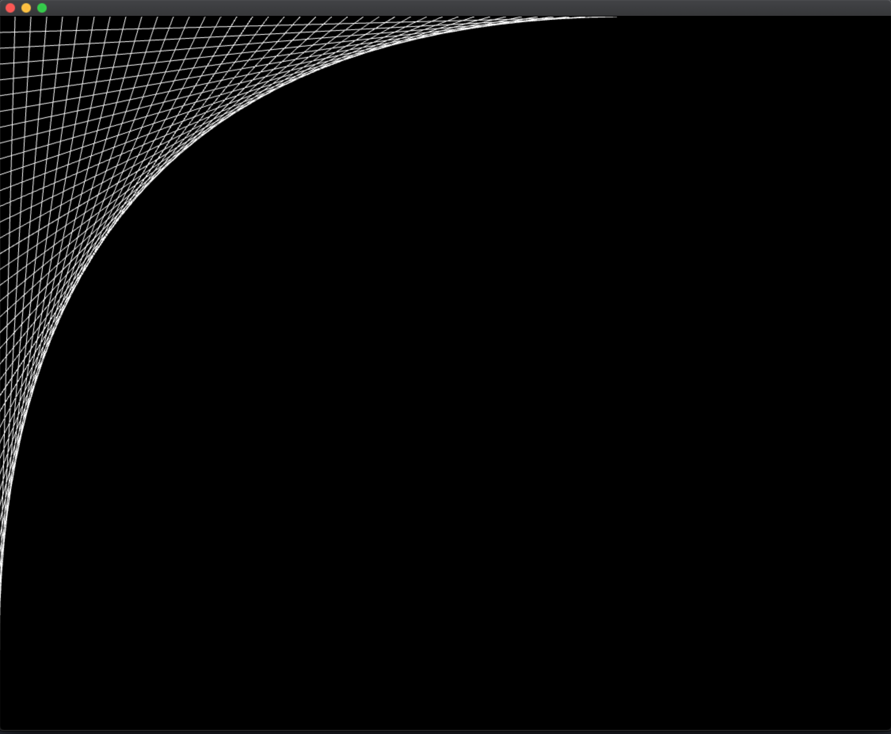

# Day 3: Review of variables

- **Lecture time:** 3 hours
- **Homework time:** 2 hours

## Learning outcomes

## Lecture (3 hours)

### Exercise 1: Variable review

Consider the following questions. Some of these we haven't covered yet explicitly, but it's a good structure for a discussion with students.

1.  What are the 4 different steps of a variable's life cycle?

2.  What does the following line do?

    ```
    float myVariable;
    ```

    What does the `float` mean here?

3.  What about these lines?

    ```
    float myVariable;
    myVariable = 3.14;
    ```

4.  And these?

    ```
    float myVariable = 3.14;
    ```

5.  What's wrong with these lines?

    ```
    float myVariable = 3.14;
    float myVariable = 5.64;
    ```

6.  What's the difference between `int` and `float`?

7.  What do these lines do?
    
    ```
    float x = 3.14;
    int y = x;
    ```

8.  What's the difference between putting a variable in a function versus putting it in `ofApp.h`?

9.  What happens if you declare a variable in `ofApp.h` *and* within a function?
    
    `ofApp.h`:

    ```cpp
    class ofApp : public ofBaseApp{
  
      public:
        // functions not shown
        float x
    }
    ```

    `ofApp.cpp`:
    
    ```cpp
    void ofApp::setup() {
      float x = 3.14;
    }
    ```

10. What is the result of `wholepart`?

    ```
    float variable = 3.14;
    int wholepart = sqrt(abs(variable) * 3) + variable;
    ```

#### Exercise 1 solutions

1.  What are the 4 different steps of a variable's life cycle?
    
    1.  Declaration
    2.  Assignment
    3.  Using
    4.  Death

2.  This declares a variable called `myVariable`. The type of the variable is a `float`, which can store decimal numbers.

3.  Here we're declaring a variable on one line, and assigning it on the next line.

4.  This is an example of declaring *and* assigning on the same line. It's a more compact version of #3.

5.  You can't have two variables with the same name. This will be a compiler error.

6.  `int` stores an integer, which is a "whole number". `float` stores a decimal number.

7.  When we assign a `float` number to an `int`, it truncates the `float` — in other words, it rounds down.

8.  Putting a variable in a function means the variable lives for the lifetime of the function. Putting a variable in the `.h` file means it persists for the lifetime of the program.

9.  You usually want to avoid this. TODO: continue

// TODO: answers for below

10. What is the result of `wholepart`?

    ```
    float variable = 3.14;
    int wholepart = sqrt(abs(variable) * 3) + variable;
    ```

### Exercise 2: Function review

1.  What's a good way to think of a function?

    A bit of code that you can write and stash away for later, to be called whenever you want. It also can also optionally accept input and return output.

2.  The simplest type of function is one that doesn't have any parameters and doesn't have any return value. How do you add such a function to your program?
  
    `ofApp.h`:

    ```cpp
    class ofApp : public ofBaseApp{
      public:
        // functions not shown
        void myFunction();
    }
    ```

    `ofApp.cpp`:
    
    ```cpp
    void ofApp::myFunction() {
      // function code does here
    }
    ```

3.  You can also write a function that returns output. Write a function called thinkOfANumber() that returns a random `int` between 1 - 10.

    `ofApp.h`:

    ```cpp
    class ofApp : public ofBaseApp{
      public:
        // functions not shown
        int thinkOfANumber();
    }
    ```

    `ofApp.cpp`:
    
    ```cpp
    void ofApp::thinkOfANumber() {
      return floor(ofRandom(1, 11));
    }

    void ofApp::setup() {
      // now we can use "thinkOfANumber" anywhere in our program
      cout << thinkOfANumber() << endl;
      cout << thinkOfANumber() << endl;
      cout << thinkOfANumber() << endl;
    }
    ```

4.  Now modify the `thinkOfANumber` to add a parameter called `high` that determines an inclusive upper bound for the random numbers.

       `ofApp.h`:

    ```cpp
    class ofApp : public ofBaseApp{
      public:
        // functions not shown
        int thinkOfANumber();
    }
    ```

    `ofApp.cpp`:
    
    ```cpp
    void ofApp::thinkOfANumber() {
      return floor(ofRandom(1, high + 1));
    }

    // alternative implementation; does the exact same thing
    void ofApp::thinkOfANumber() {
      return ceil(ofRandom(0, high));
    }

    void ofApp::setup() {
      // now we can use "thinkOfANumber" anywhere in our program
      cout << thinkOfANumber(20) << endl;
      cout << thinkOfANumber(100) << endl;
      cout << thinkOfANumber(1000) << endl;
    }
    ```


### Mouse interaction

Now we're going to create "drawing program" with a little more sophisticated mouse interaction. First, let's create a circle that follows the mouse:

`ofApp.cpp`:

```cpp
void ofApp::setup() {
  ofBackground(0);
  ofSetBackgroundAuto(0);
}

void ofApp::draw() {
  ofDrawCircle(mouseX, mouseY, 4);
}
```

This leaves at trail of circles on the canvas, which is cool! However, the circles are disconnected. We want to draw a line that connects each circle. We can do this by every frame drawing a line from the _current_ mouse (x, y) to the _previous_ mouse (x, y). In order to remember the mouse's last position, introduce new variables to the `.h` file:

```cpp
class ofApp : public ofBaseApp{
  
public:
  // functions not shown
  float lastPositionX;
  float lastPositionY;
};
```

Next update our `draw` function:

```cpp
void ofApp::draw() {
  ofDrawLine(lastPositionX, lastPositionY, mouseX, mouseY);
  
  lastPositionX = mouseX;
  lastPositionY = mouseY;
}
```

This draws a line from the previous mouse position to the current mouse position, and then updates the previous position for the next frame.


### An aside: while loops

On day 2, we introduced for loops. For loops are very useful for creative coding, and you'll end up using them a lot. However, they have a very dense syntax. There is a simpler type of loop that you can use in some cases called a "while loop". A while loop has the following syntax:

```cpp
while (condition) {
  code
}
```

The code within the while loop will be run as long as the `condition` is true. The moment the `condition` is false, then the loop no longer runs. Here's an example of a loop that will run 10 times:

```cpp
// initialization
int i = 0;
while (i < 10) { // condition
  i = i + 1; // update
}
```

You can see that there's a similar pattern to a for loop, where we initialize a looping variable and then update it. It's a different way of expressing the same concept. A while loop always has three parts: initialization, condition and update.

### Drawing with for loops

You might have drawn this pattern when you were bored in class as a kid.



How could we produce it with code? Because we're drawing many lines, we know we're going to use a for loop. Let's say we want to draw this picture with 100 lines.

```cpp
void ofApp::draw() {
  ofBackground(0);
  for (int i = 0; i < 100; i++) {
    // what goes here?
  }
}
```

There's a pattern to where the lines start and end which might be easier to work out on paper or whiteboard. The first thing you need to emphasize is that we need to count _forward_ and _backwards_ at the same time. So let's add a backwards counter inside of our loop:

```cpp
void ofApp::draw() {
  ofBackground(0);
  for (int i = 0; i < 100; i++) {
    int backwards = 100 - 1 - i;
  }
}
```

Why do we have the `- 1` above? We want our backwards counter to start at `99`, because our forwards counter `i` ends at `99`. If you're confused about why `i` ends at 99, think carefully about the bounds of the loop (`i < 100`).

Now let's draw the lines:

```cpp
void ofApp::draw() {
  ofBackground(0);
  
  for (int i = 0; i < 100; i++) {
    // i counts forwards, but we also need a counter
    // that goes backwards
    int backwards = 100 - 1 - i;
    
    float x1 = ofGetWidth() / 100 * i;
    float y1 = 0;
    float x2 = 0;
    float y2 = ofGetHeight() / 100 * backwards;
    ofDrawLine(x1, y1, x2, y2);
  }
}
```

This produces the picture that we want. It's doing a lot of tricky math, so again it might be helpful to simulate the steps here and draw lines on the white board.

One final touch: we can factor out the `100` into a variable so we don't have to keep repeating ourselves:

```cpp
void ofApp::draw() {
  ofBackground(0);
  
  int numSegments = 100;

  for (int i = 0; i < numSegments; i++) {
    // i counts forwards, but we also need a counter
    // that goes backwards
    int backwards = numSegments - 1 - i;
    
    float x1 = ofGetWidth() / numSegments * i;
    float y1 = 0;
    float x2 = 0;
    float y2 = ofGetHeight() / numSegments * backwards;
    ofDrawLine(x1, y1, x2, y2);
  }
}
```

### Objects

Up until now, we've been using primitive types for our variables (`float`, `int`). These variables store only _one_ thing. But there are more complex types of variables in C++ called **objects**. Objects are containers for multiple variables. An example of an object type is an `ofPoint`.

```cpp
ofPoint myPoint;
myPoint.x = 50;
myPoint.y = 100;
```

Here we declare a new `ofPoint` object, and then set the x and y values _inside_ of the object. We're introducing **dot notation** syntax. The dot (`.`) after `myPoint` allows us to access variables that are inside of the `myPoint` object. There's another syntax for storing values in the object:

```cpp
ofPoint myPoint(50, 100);
```

This does the same thing, but is more compact.

Now we can use those variables just like we would a normal variable:

```cpp
ofPoint myPoint;
myPoint.x = 50;
myPoint.y = 100;

cout << myPoint.x << endl;
cout << myPoint.y << endl;
```

The `ofPoint` type is useful for cleaning up the earlier mouse interaction (TODO: link) example we did before.

`ofApp.cpp`:

```cpp
void ofApp::setup() {
  ofBackground(0);
  ofSetBackgroundAuto(0);
}

void ofApp::draw() {
  ofDrawCircle(mouseX, mouseY, 4);
}
```

This leaves at trail of circles on the canvas, which is cool! However, the circles are disconnected. We want to draw a line that connects each circle. We can do this by every frame drawing a line from the _current_ mouse (x, y) to the _previous_ mouse (x, y). In order to remember the mouse's last position, introduce new variables to the `.h` file:

`ofApp.h`:

```cpp
class ofApp : public ofBaseApp{
  
public:
  // functions not shown
  ofPoint lastPosition
};
```

`ofApp.cpp`:

```cpp
void ofApp::draw() {
  ofDrawLine(lastPosition.x, lastPosition.y, mouseX, mouseY);
  
  lastPosition.x = mouseX;
  lastPosition.y = mouseY;
}
```

This allows us to group conceptually related variables into a single container. `ofPoint` is a container provided to us by openFrameworks for storing coordinates (x and y), but there are lots of other types of objects that we can use to group related variables.

### Arrays and vectors

There's another way to group related variables together in C++: using an array. An array is similar to an object in that it stores variables inside of it. However, it has a core difference: an array is used to store a _list_ of variables. Here's how we declare an array:

```cpp
float myArray[100];
```

This declares a list of 100 floats with the name `myArray`. If we want to set the items in the list, we use the following syntax:

```cpp
float myArray[100];
myArray[0] = 42;
myArray[1] = 100;
myArray[2] = 102;
myArray[3] = 55;
```

The `[]` syntax allows us to access items inside of the array. The number inside of the `[` and `]` is called the _index_. Note that indices start at 0. In other words, the first item in the array can be set using `myArray[0]`. We also use this syntax to access items in the array:

```cpp
// print the variable at the 0-th index in the array:
cout << myArray[0] << endl;
```

One limitation of arrays is that they have a fixed size. In the above example, we declared an array of size 100 — that means there are 100 spots in the array that we can access. There's another related structure in C++ that has a variable size: a **vector**.

### Vectors

To declare a vector:

```cpp
vector<float> myVector;
```

This declares a vector that can store a list of floats. We haven't seen the `<float>` syntax before — this is how we tell a vector what type of list it is.

Let's add some stuff to our vector:

```cpp
vector<float> myVector;
myVector.push_back(5);
myVector.push_back(7);
myVector.push_back(100);
myVector.push_back(32);
```

This `.push_back(...)` syntax allows us to append values to our vector. Every time we call `push_back`, we're adding a value to the end of the list. After we call it 4 times, our vector has 4 items inside of it. To access those items, we use the same syntax as arrays:

```cpp
cout << myVector[0] << endl;
cout << myVector[1] << endl;
cout << myVector[2] << endl;
cout << myVector[3] << endl;
```

We can ask a vector how many elements it's storing using the `.size()` function:

```cpp
cout << myVector.size() << endl;
```

This will print out 4, because we've added 4 things to our vector.

To summarize: a vector is a list of variables that we can add things to and access.

Vectors can be used in conjunction with for loops in various ways. A common use case is looping over the elements of a vector:

```cpp
for (int i = 0; i < myVector.size(); i = i + 1) {
  cout << myVector[i] << endl;
}
```

This will print out all of the elements of the vector.

We're not limited to storing `float`s inside of arrays and vectors. We can store _any_ type inside of these structures (`int`, `bool`, etc.). We can also store objects (like `ofPoint`).

```cpp
// create a list of points and add three points
vector<ofPoint> myVector;
myVector.push_back(ofPoint(5, 2));
myVector.push_back(ofPoint(50, 12));
myVector.push_back(ofPoint(999, 4));
```

This syntax is a little new. When we call `ofPoint(5, 2)`, we're constructing a new point. Then we write `myVector.push_back(ofPoint(5, 2));`, we're adding a new point to the end of the vector.

### Drawing with vectors

Vectors are very useful for creative coding, because they allow us to remember an arbitrary large number of values. For example, we can use a vector to store all of the previous mouse positions. Add this to your `.h` file:

```cpp
class ofApp : public ofBaseApp{
  
public:
  // functions not shown
  vector<ofPoint> previousPoints;
};
```

Now on every frame in our `draw` function, we can append the mouse position to our vector:

```cpp
void ofApp::draw() {
  ofBackground(0);
  previousPoints.push_back(ofPoint(mouseX, mouseY));
}
```

There's a lot going on here. We're constructing a new `ofPoint` object with the `ofPoint(mouseX, mouseY)` syntax. Then we're appending that to our `previousPoints` list. As the program executes, the `previousPoints` vector will grow as new points are appended. What can we do with this vector? Let's draw circles for every point in the `previousPoints` vector:

```cpp
void ofApp::draw() {
  ofBackground(0);
  previousPoints.push_back(ofPoint(mouseX, mouseY));

  for (int i = 0; i < previousPoints; i = i + 1) {
    float x = previousPoints[i].x;
    float y = previousPoints[i].y;
    ofDrawCircle(x, y, 5);
  }
}
```

Rather than drawing circles at each point, how can we draw lines _between_ the lines? Here's an attempt at doing that:

```cpp
void ofApp::draw() {
  ofBackground(0);
  previousPoints.push_back(ofPoint(mouseX, mouseY));
  
  for (int i = 0; i < previousPoints.size(); i = i + 1) {
    float x1 = previousPoints[i - 1].x;
    float y1 = previousPoints[i - 1].y;
    float x2 = previousPoints[i].x;
    float y2 = previousPoints[i].y;
    ofDrawLine(x1, y1, x2, y2);
  }
}
```

This loops through our `previousPoints` vector, and for each point, draws a line from the previous point (at position `i - 1`) to the current point (at `i`). In this way, a line is drawn between successive pairs of points. There's a subtle bug in our loop, though. Even though this _mostly_ works, we might see weird artifacts sometimes — a line drawn in a way we don't expect. To understand why this happens, consider the case when `i = 0`. In this case, `i - 1 = -1`. If we try to access `previousPoints[-1].x;`, it's not clear what this means. What is a negative index? Even though the program runs, this code is nonsensical — we could get an `x` value back that we don't expect.

The solution to this subtle problem is to change the bounds of our loop so that we never access index `-1`. Let's start our loop at `i = 1` rather than `i = 0`:

```cpp
void ofApp::draw() {
  ofBackground(0);
  previousPoints.push_back(ofPoint(mouseX, mouseY));
  
  for (int i = 1; i < previousPoints.size(); i = i + 1) {
    float x1 = previousPoints[i - 1].x;
    float y1 = previousPoints[i - 1].y;
    float x2 = previousPoints[i].x;
    float y2 = previousPoints[i].y;
    ofDrawLine(x1, y1, x2, y2);
  }
}
```

One thing we can do with vectors is _remove_ elements of the list. We can use this to achieve interesting effects when drawing our mouse history. For example, after we add more than 100 positions to our vector, let's remove the first point of the vector every frame:


```cpp
void ofApp::draw() {
  ofBackground(0);
  previousPoints.push_back(ofPoint(mouseX, mouseY));
  
  for (int i = 1; i < previousPoints.size(); i = i + 1) {
    float x1 = previousPoints[i - 1].x;
    float y1 = previousPoints[i - 1].y;
    float x2 = previousPoints[i].x;
    float y2 = previousPoints[i].y;
    ofDrawLine(x1, y1, x2, y2);
  }
  
  if (previousPoints.size() > 100) {
    previousPoints.erase(previousPoints.begin());
  }
}
```

The line `previousPoints.erase(previousPoints.begin());` removes the first element of the list. If you run this program, you'll see a line that trails 100 points behind the mouse.

## Homework 3: Rain

Using a vector of ofPoints, create a program that simulates falling rain. The rain can be rendered however you want (ex. circles). The circles should start at the top of the screen at random positions and fall to the bottom. When the rain drops hit the bottom of the window, they should be removed from the vector.

### Solution


## Vocabulary

## Common misconceptions & questions

- Difference between array and vector?
- Difference between object and array?
- Go off end of array?
- In the line drawing examples, why does the line always start in the upper left corner?
