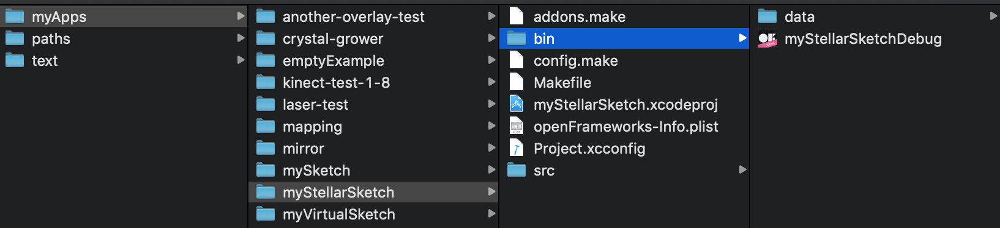

# Day 4: Polylines, classes and 3D graphics

- **Lecture time:** 3 hours
- **Homework time:** 2 hours

## Learning outcomes

- Use Polylines to draw shapes
- How to share openFrameworks apps
- Using the openFrameworks `update` function
- Basic intro to C++ classes (member variables, functions)
- Transformations
- Using pushMatrix / popMatrix to remember transformation state
- 3D graphics
- Basic Lighting in openFrameworks

## Lecture (3 hours)

### Polylines

At the end of Day 3's lecture, we built a `vector` of `ofPoint`s in order to create a trail behind the mouse. As the mouse moved, we appended `ofPoint`s to the end of the `vector`. Then we looped through the `vector` and drew lines between the points. Recall that declaring the vector looked like this:

```cpp
vector<ofPoint> points;
```

Storing a list of points turns out to be a common pattern in creative coding and graphics in general. openFrameworks provides a type that we can use to store lists of points called a **polyline**. We can replace our vector of points with a polyline:

```cpp
ofPolyline polyline;
```

Under the hood, `ofPolyline` stores a vector of points. But it adds additional functionality that we'll find useful. Let's rewrite our example from yesterday using `ofPolyline`:

// TODO: add link to prev example

`ofApp.h`:

```cpp
class ofApp : public ofBaseApp{
  
public:
  // functions not shown
  ofPolyline poly;
};
```

`ofApp.cpp`:

```cpp
void ofApp::draw() {
  ofBackground(0);
  
  poly.addVertex(mouseX, mouseY);
  poly.draw();

  if (poly.size() > 100) {
    poly.getVertices().erase(poly.getVertices().begin());
  }
}
```

We no longer need a for loop to draw our lines — `ofPolyline` does that for us with a call to `poly.draw()`. Also note that if we want to access the underlying vector of points, we can call `poly.getVertices()`. This returns the vector, which we can manipulate just like any other vector.

An example of another benefit of using `ofPolyline` is the `getSmoothed` function:

```cpp
void ofApp::draw() {
  ofBackground(0);
  
  poly.addVertex(mouseX, mouseY);
  poly.getSmoothed(10).draw();

  if (poly.size() > 100) {
    poly.getVertices().erase(poly.getVertices().begin());
  }
}
```

You can adjust the smoothing amount passed into `getSmoothed(...)` to get different effects.

### Update vs draw

Thus far, we've been putting all of our code in the `draw` and `setup` function. You might have noticed that openFrameworks generates an `update` function as well. This function is for anything that _updates state_. If we want to use openFrameworks in the "right way", we should separate our code out into code that updates, and code that draws. It's useful to split up code into these two functions to keep things organized. Here's an example of how we could split up the code above:

`ofApp.cpp`:

```cpp
void ofApp::update() {
  poly.addVertex(mouseX, mouseY);
  if (poly.size() > 100) {
    poly.getVertices().erase(poly.getVertices().begin());
  }
}

void ofApp::draw() {
  ofBackground(0);
  poly.draw();
}
```

One rule with using `update` vs `draw` is that you cannot put drawing code inside of `update` — it simply won't draw. Another rule: if you want to share a variable between `update` and `draw`, it must be placed in the `ofApp.h` file. 

### Aside: sharing applications

How would you go about sharing your openFrameworks creation with a friend? Find the folder in your operating system where your project was created. Every time you build and run your project within your IDE, an application is built and put inside of the `bin` folder of your project. Here's what that looks like on MacOS:



In the above screenshot, the `myStellarSketchDebug` file is our application. You can double click on this file to launch your openFrameworks sketch. You could also email this file to a friend!

### Bouncing balls

Let's say we wanted to create a sketch with a bouncing ball. It might look similar to this:

`ofApp.h`:

```cpp
class ofApp : public ofBaseApp{
  
public:
  // functions not shown
  
  ofPoint position;
  ofPoint direction;
};
```

`ofApp.cpp`:

```cpp
void ofApp::setup() {
  position.x = ofRandom(ofGetWidth());
  position.y = ofRandom(ofGetHeight());

  direction.x = ofRandom(-10, 10);
  direction.y = ofRandom(-10, 10);
}

void ofApp::update() {
  position = position + direction;

  // the line above is shorthand for:
  // position.x = position.x + direction.x;
  // position.y = position.y + direction.y;


  // keep ball within the bounds of the screen

  // left bound
  if (position.x < 0) {
    position.x = 0;
    direction.x = -direction.x;
  }

  // top bound
  if (position.y < 0) {
    position.y = 0;
    direction.y = -direction.y;
  }

  // right bound
  if (position.x > ofGetWidth()) {
    position.x = ofGetWidth();
    direction.x = -direction.x;
  }

  // bottom bound
  if (position.y > ofGetHeight()) {
    position.y = ofGetHeight();
    direction.y = -direction.y;
  }
}


void ofApp::draw() {
  ofBackground(0);

  // we're using a different version of ofDrawCircle here, where we can pass in
  // an ofPoint. this is identical to using ofDrawCircle(position.x, position.y, 10);
  ofDrawCircle(position, 10);
}

// other functions not shown
```

// TODO: add link to day 2 homework? 
The bound checking code might be a little confusing, although you might have done something similar to this in homework 2. Let's take a closer look at the left bound:

```cpp
if (position.x < 0) {
  position.x = 0;
  direction.x = -direction.x;
}
```

First we test to see if the x position of the ball is off the left edge of the screen. If it is, we need to do two things: reset the position so that it's directly on the edge. If we didn't do this, the ball could get stuck off the edge of the window. Next, we need to flip the x direction so the ball bounces.

Next, let's add a line to `update` that implements gravity:

```
position.y = position.y + 0.2;
```

This accelerates the ball down by 0.2 every frame! Now we have a bouncy ball that responds to gravity.

Now let's give our ball a radius and color. Add these variables to the `.h` file:

```cpp
class ofApp : public ofBaseApp{
  
public:
  // functions not shown
  
  ofPoint position;
  ofPoint direction;
  float radius;
  ofColor color;
};
```

Here we're introducing a new openFrameworks type: `ofColor`. `ofColor` stores an red-green-blue color, in the same way that `ofPoint` stores a position. In our setup function, let's initialize our color and radius:

```cpp
void ofApp::setup() {
  position.x = ofRandom(ofGetWidth());
  position.y = ofRandom(ofGetHeight());

  direction.x = ofRandom(-10, 10);
  direction.y = ofRandom(-10, 10);

  radius = ofRandom(10, 20);
  color = ofColor(ofRandom(255), ofRandom(255), ofRandom(255));
}
```

Now let's update our `draw` and `update` to use this color and radius:

```cpp
void ofApp::update() {
  position = position + direction;

  // the line above is shorthand for:
  // position.x = position.x + direction.x;
  // position.y = position.y + direction.y;


  // keep ball within the bounds of the screen

  // left bound
  if (position.x < radius) {
    position.x = radius;
    direction.x = -direction.x;
  }

  // top bound
  if (position.y < radius) {
    position.y = radius;
    direction.y = -direction.y;
  }

  // right bound
  if (position.x > ofGetWidth() - radius) {
    position.x = ofGetWidth() - radius;
    direction.x = -direction.x;
  }

  // bottom bound
  if (position.y > ofGetHeight() - radius) {
    position.y = ofGetHeight() - radius;
    direction.y = -direction.y;
  }
}


void ofApp::draw() {
  ofBackground(0);

  // we're using a different version of ofDrawCircle here, where we can pass in
  // an ofPoint. this is identical to using ofDrawCircle(position.x, position.y, 10);
  ofSetColor(color);
  ofDrawCircle(position, radius);
}

// other functions not shown
```

Adding our `radius` into our bounds checking ensures that the circle stays completely outside the bounds of the windows (you might have noticed that previously, the circle "passed through" the wall half way before bouncing). We also use the `color` and `radius` variables in our `draw` function to draw the circle with a specific radius and color.

What if we want more than one ball? Say, 1000 balls? Yesterday, we learned about how vectors allow us to store a list of values. How would we use vectors to store information about multiple balls? Here's one approach we might start with:

`ofApp.h`:

```cpp
class ofApp : public ofBaseApp{
  
public:
  // functions not shown
  
  vector<ofPoint> positions;
  vector<ofPoint> directions;
  vector<float> radius;
  vector<ofColor> color;
};
```

Now we can have multiple positions, directions, radii and colors. The `positions[0]` would correspond to `directions[0]`, `positions[1]` would correspond to `directions[1]`, etc. This approach is called **parallel arrays**, and it would allow us to achieve our goal of having multiple balls.

However, there is a better approach: using **classes**.

### Classes

Classes allow us to create _new types of objects_. We can make a class that stores all the relevant data to represent a ball: position, direction, radius and color. To define a class, add the following to the `ofApp.h` file:

```cpp

class Ball {
  ofPoint position;
  ofPoint direction;
  float radius;
  ofColor color;
}

class ofApp : public ofBaseApp{
  
public:
  // functions not shown};
```

This packages up our related variables into a single container called `Ball`. We can also add _functions_ to our class as well. These functions live "inside" of the class:

```cpp
class Ball {
  ofPoint position;
  ofPoint direction;
  float radius;
  ofColor color;

public:
  void setup();
  void update();
  void draw();
}
```

We're following the openFrameworks paradigm here by adding three functions: `setup`, `update`, and `draw`. Note that we could add whatever functions we want, but it's common in openFrameworks to write these functions. We've declared these functions, but we still need to _define_ them. We can do this back in our `ofApp.cpp` file:

```cpp
void Ball::setup() {

}

void Ball::update() {
    
}

void Ball::draw() {
    
}
```

We can now cut-and-paste anything relating to our ball into these functions:

```cpp
void Ball::setup() {
  position.x = ofRandom(ofGetWidth());
  position.y = ofRandom(ofGetHeight());
  
  direction.x = ofRandom(-10, 10);
  direction.y = ofRandom(-10, 10);
  
  radius = ofRandom(10, 20);
  color = ofColor(ofRandom(255), ofRandom(255), ofRandom(255));
}

void Ball::update() {
  position = position + direction;
  direction.y = direction.y + 0.5;
  // keep ball within the bounds of the screen
  
  // left bound
  if (position.x < radius) {
    position.x = radius;
    direction.x = -direction.x;
  }
  
  // top bound
  if (position.y < radius) {
    position.y = radius;
    direction.y = -direction.y;
  }
  
  // right bound
  if (position.x > ofGetWidth() - radius) {
    position.x = ofGetWidth() - radius;
    direction.x = -direction.x;
  }
  
  // bottom bound
  if (position.y > ofGetHeight() - radius) {
    position.y = ofGetHeight() - radius;
    direction.y = -direction.y;
  }
}

void Ball::draw() {
  ofSetColor(color);
  ofDrawCircle(position, radius);
}
```

This is a big conceptual leap. We've been using objects (like `ofPoint` and `ofPolyline`). These objects store data and provide functions for using and manipulating that data. But now we're defining our own type of object. We're defining the type of data that it stores, and the functions which use that data.

Next, let's add a vector of `Ball` to our `.h` file:

```cpp
class ofApp : public ofBaseApp{
    public:
        // functions not shown

        vector<Ball> balls;
};
```

Finally, let's update our `ofApp::setup`, `ofApp::update` and `ofApp::draw` to use this vector of `Ball`s:

```cpp
void ofApp::setup() {
  // Add 1000 balls to the vector
  for (int i = 0; i < 1000; i++) {
    // create the ball object
    Ball b;

    // call the setup function of the ball
    b.setup();

    // add it to the vector
    balls.push_back(b);
  }
}

void ofApp::update() {
  // loop through the vector of balls and update each ball
  for (int i = 0; i < balls.size(); i++) {
    balls[i].update();
  }
}

void ofApp::draw() {
  // loop through the vector of balls and draw each ball
  for (int i = 0; i < balls.size(); i++) {
    balls[i].draw();
  }
}
```

If you run this, you should see a thousand balls bouncing around the window!

// TODO: add video

Next, we're going to modify our Ball's `setup` function to accept a parameter:

`ofApp.h`:

```cpp
class Ball {
  ofPoint position;
  ofPoint direction;
  float radius;
  ofColor color;

public:
  void setup(ofPoint pos);
  void update();
  void draw();
};
```

`ofApp.cpp`:

```cpp
void Ball::setup(ofPoint pos) {
  position = pos;
  
  direction.x = ofRandom(-10, 10);
  direction.y = ofRandom(-10, 10);
  
  radius = ofRandom(10, 20);
  color = ofColor(ofRandom(255), ofRandom(255), ofRandom(255));
}
```

Now when we create our balls inside of `ofApp::setup`, we can pass in a position to `Ball::setup`:

```cpp
void ofApp::setup(){
  for (int i = 0; i < 1000; i++) {
    Ball b;

    // pass in a position into the ball's setup function
    b.setup(ofPoint(ofGetWidth() / 2, ofGetHeight() / 2));

    balls.push_back(b);
  }
}
```

### Exercise 1: Add setup parameters

Add radius and color parameters to `Ball::setup`. This will follow a similar pattern as when we added the position parameter above.

#### Exercise 1 solution

// TODO:


### Transformations

Now we're going to introduce **transformations**. There are 3 transformation functions we'll look at:

- `ofTranslate(x, y)`
- `ofRotateDeg(degrees)`
- `ofScale(scale)`

Let's go back to a very basic example: drawing a rectangle to the window. Let's say we want a rectangle with a top left corner at (25, 60) and a width and height of 100:

```cpp
void ofApp::draw() {
  ofBackground(0);
  ofDrawRectangle(25, 50, 100, 100);
}
```

An equivalent way of doing the same thing is to use the `ofTranslate` function:

```cpp
void ofApp::draw() {
  ofBackground(0);
  ofTranslate(25, 50);
  ofDrawRectangle(0, 0, 100, 100);
}
```

`ofTranslate` shifts the origin — or (0, 0) point — to the right 25 pixels and down 50 pixels. Then when we draw a rectangle with its upper left corner at (0, 0), it _actually_ draws it at (25, 50). If we imagine openFrameworks as drawing to a canvas, `ofTranslate` is like moving the entire canvas.

It may seem like this is just a slightly more cumbersome way of drawing a rectangle at a given (x, y) position. And right now, it is. But one difference is that calls to `ofTranslate` _accumulate_. For example:

```cpp
void ofApp::draw() {
  ofBackground(0);

  // move origin to 25, 50
  ofTranslate(25, 50);
  ofDrawRectangle(0, 0, 100, 100);

  // move origin right by 100 pixels
  ofTranslate(200, 0);
  ofDrawRectangle(0, 0, 100, 100);
}
```

The first call to `ofTranslate` moves the origin to (25, 50) and draws a rectangle there. The second call is applied on top of the that first transformation, and moves the origin to (225, 50) — 200 pixels to the right of (25, 50). The second rectangle is then drawn at (225, 50). If we wanted, we could set the origin to the mouse:

```cpp
void ofApp::draw() {
  ofBackground(0);

  // move origin to 25, 50
  ofTranslate(mouseX, mouseY);
  ofDrawRectangle(0, 0, 100, 100);

  // move origin right by 100 pixels
  ofTranslate(200, 0);
  ofDrawRectangle(0, 0, 100, 100);
}
```

Now as we move the mouse around the screen, we shift both rectangles. You might start to see why `ofTranslate` is useful. Changing the origin is a powerful drawing tool. Next, let's talk about `ofScale`:

```cpp
void ofApp::draw() {
  ofBackground(0);

  ofScale(2);

  // move origin to 25, 50
  ofTranslate(50, 25);
  ofDrawRectangle(0, 0, 100, 100);

  // move origin right by 100 pixels
  ofTranslate(200, 0);
  ofDrawRectangle(0, 0, 100, 100);
}
```

Our call to `ofScale(2)` here scales up the canvas by 2, zooming in by 200%.

Lastly, let's talk about `ofRotateDeg`. This is the most useful transformation. Let's say we want to rotate a rectangle. This is actually pretty hard to do if you think about it — it turns out that rotations involve some math. But we can use `ofRotateDeg` to do that fancy stuff for us.

The important thing to understand is that `ofRotateDeg` _always rotates around the origin_. Let's see what we mean by that. We'll rotate by `mouseX` so that we can see the rotation in action as we move the mouse back and forth:

```cpp
void ofApp::draw() {
  ofBackground(0);

  ofRotateDeg(mouseX);
  ofDrawRectangle(0, 0, 100, 100);
}
```

What you'll notice now is that the rectangle is rotating by it's upper left corner around the origin at (0, 0). Let's say we want the rectangle to rotate around the center of the window. We know that `ofRotateDeg` always rotates around the origin, so we must move the origin to the center of the window:

```cpp
void ofApp::draw() {
  ofBackground(0);

  ofTranslate(ofGetWidth() / 2, ofGetHeight() / 2);
  ofRotateDeg(mouseX);
  ofDrawRectangle(0, 0, 100, 100);
}
```

This is a common pattern that you'll often use for rotating objects. First, use `ofTranslate` to move the origin. Then, use `ofRotateDeg` to rotate around that point. What if we want the rectangle to rotate around its center? We can do this by drawing the rectangle centered around the origin, rather than on the top-left point:

```cpp
void ofApp::draw() {
  ofBackground(0);

  ofTranslate(ofGetWidth() / 2, ofGetHeight() / 2);
  ofRotateDeg(mouseX);
  ofDrawRectangle(-50, -50, 100, 100);
}
```

Drawing a rectangle with its top left corner at (-50, -50) and width and height of 100 means that the center of the rectangle will fall at (0, 0), which is the origin.

### Push and pop

// TODO

### 3D graphics

So far, we've only used openFrameworks to draw 2D graphics. But there are functions in openFrameworks to draw 3 dimensional shapes. One simple example is drawing a box:

```cpp
void ofApp::draw() {
  ofBackground(0);
  ofDrawBox(200);
}
```

This draws a cube with a width of 200 pixels. We haven't told the box _where_ to be drawn, but by default, it will be drawn at the origin (0, 0).

When we're drawing in 3D, we often want to introduce a _camera_ to the scene that we can use to view our 3D shapes. openFrameworks has a built in camera that we can use. Add this to the `.h` file:

```cpp
class ofApp : public ofBaseApp{
    public:
        // functions not shown
        ofEasyCam camera;
};
```

Now to use the camera in your `draw` function:

```cpp
void ofApp::draw() {
  ofBackground(0);
  
  camera.begin();
  ofDrawBox(200);
  camera.end();
}
```

`camera.begin` turns on the "camera mode". In this new camera mode, the origin is transformed to the center of the screen automatically. In addition, you can use your mouse to rotate around the origin. In order to see the 3D effect better, let's add 3D axis:

```cpp
void ofApp::draw() {
  ofBackground(0);
  
  camera.begin();
  ofDrawBox(200);
  ofDrawAxis(300);
  camera.end();
}
```

// TODO: talk about why depth test is necessary

// TODO: add a light

## Homework 3: 3D Scene

Create a grassy green plane with a box sitting on top of the plane. This will require using both ofEasyCam and transformations. 

### Solution

## Vocabulary

## Common misconceptions & questions

TODO

- What does `Ball b` mean?
- What does `b.setup` mean?
- What's the difference between a class and an object?
- Can I still call openFrameworks functions inside of my class?
- Push without pop
